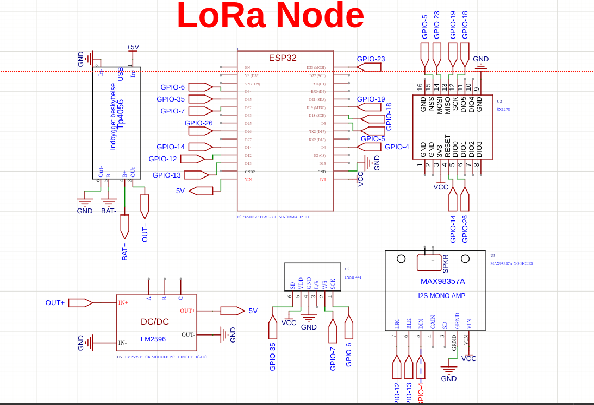
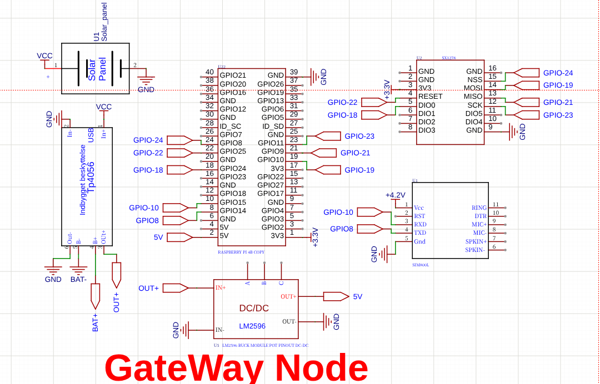
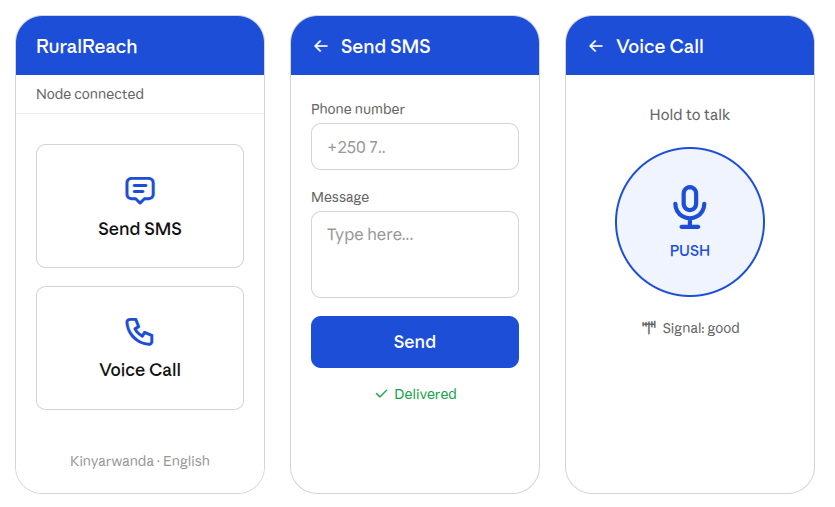

# RuralReach — Initial Software Demo

> Embedded LoRa-to-GSM gateway enabling **SMS and real-time push-to-talk voice** from cellular dead zones in rural Rwanda. The recipient uses an ordinary phone on the normal GSM network.

**Author:** Ramadhani Shafii Wanjenja
**Programme:** BSc. Software Engineering (Low-Level Programming) — African Leadership University
**Supervisor:** Thadee Gatera
**Track:** Low Level
**Language:** C / C++ (node firmware) and Python (gateway)

---

## 1. Description

RuralReach is a two-part embedded system that extends mobile communication into cellular dead zones — places a few kilometres from a cell tower but blocked by ridges, common across rural Rwanda.

- The **LoRa Node** lives in the dead zone. A user pairs their own phone to it over Bluetooth to send SMS, or presses a push-to-talk button to speak. Built on the **Heltec ESP32 LoRa V3 (SX1278, 433 MHz)** in **C using ESP-IDF**.
- The **Gateway** sits where GSM coverage exists. It receives LoRa packets and bridges them into the real cellular network using a **SIM800L** modem, so the recipient gets a normal SMS or a normal phone call. Built on a **Raspberry Pi** in **Python**, with a Heltec board acting as a USB-serial LoRa bridge.

Voice is push-to-talk (walkie-talkie style, ~2 s latency) because LoRa is half-duplex; the recipient still experiences a normal cellular call on their side. Voice frames are compressed with **Codec2** at 700 bps to fit inside LoRa's data rate.

---

## 2. Links

- **GitHub repository:** `https://github.com/ramadhaniwanjenja/RuralREACH/blob/main/README.md`
- **Video demo (5–10 min):** `<paste your YouTube unlisted / Drive link here>`

---

## 3. Review of Requirements & Tools

The project is a low-level embedded system, so the toolchain is chosen for hardware control, real-time behaviour, and reproducibility:

| Tool | Version | Why it was chosen |
|---|---|---|
| **ESP-IDF** | v5.1+ | Official ESP32 framework; C build system, FreeRTOS, hardware drivers, mbedTLS |
| **FreeRTOS** | bundled | Real-time task scheduling for the concurrent radio, audio, and SMS tasks |
| **C / C++** | C11 | Direct register and peripheral control on the node |
| **mbedTLS** | bundled | AES-128-CBC payload encryption |
| **Codec2** | 1.2 | Compresses voice to 700 bps so it fits in LoRa's bandwidth |
| **Python 3** | 3.11 | Gateway logic on the Raspberry Pi (pyserial for UART) |
| **pyserial** | 3.5 | UART link from the Pi to the SIM800L and to the LoRa bridge |
| **EasyEDA** | online | Schematic capture for the node and gateway circuits |
| **Git / GitHub** | latest | Version control |

---

## 4. How to Set Up the Environment and the Project

### 4.1 Node firmware (Heltec ESP32 LoRa V3)

```bash
# 1. Install ESP-IDF v5.1
mkdir -p ~/esp && cd ~/esp
git clone --recursive https://github.com/espressif/esp-idf.git
cd esp-idf && git checkout v5.1.2 && ./install.sh esp32s3 && . ./export.sh

# 2. Build and flash the node
cd ruralreach-demo/node
idf.py set-target esp32s3
idf.py build
idf.py -p /dev/ttyUSB0 flash monitor
```

### 4.2 Gateway (Raspberry Pi)

```bash
# On the Raspberry Pi (Raspberry Pi OS Lite)
sudo apt update && sudo apt install -y python3-pip codec2
cd ruralreach-demo/gateway
pip3 install -r requirements.txt
python3 gateway.py
```

---

## 5. Designs

All design assets are in the `/designs` and `/hardware` folders:

-  — overall system architecture
-  — **EasyEDA node circuit schematic**
-  — **EasyEDA gateway circuit schematic**

---

## 6. Navigation & Layout (Android Companion App)

The companion app has a deliberately simple three-screen flow so non-technical rural users can operate it:



1. **Home screen** — two large buttons: "Send SMS" and "Voice Call". Connection status shown at the top.
2. **Send SMS screen** — phone number field, message field, big Send button. Delivery tick when confirmed.
3. **Voice screen** — a single large push-to-talk button: hold to talk, release to listen.

Language can be toggled between **Kinyarwanda** and **English** from the home screen.
---

## 7. Security Measures

Security is implemented at three layers:

1. **Encryption (application layer):** Every message payload and every voice frame is encrypted with **AES-128-CBC** using mbedTLS before being transmitted over LoRa. A relay or eavesdropper cannot read content. See `node/components/aes_crypto/`.
2. **Integrity (protocol layer):** Every packet carries a **CRC-16/CCITT** checksum. Corrupted packets are dropped. A 64-entry sequence-number cache rejects replayed/duplicate packets. See `node/components/packet/`.
3. **Privacy (operational layer):** Destination phone numbers are **SHA-256 hashed** before being written to any log. Message bodies and voice audio are **never stored**. The AES pre-shared key lives in the ESP32's **encrypted NVS** partition.

---

## 8. Deployment Plan

| Phase | When | Activity |
|---|---|---|
| Build | May 2026 | Assemble node + gateway on perfboard; flash firmware; bench test SMS |
| Voice | June 2026 | Integrate Codec2 audio; test push-to-talk end to end |
| Field | Late Jun–Jul 2026 | RF survey in Nyamagabe District; 10-day pilot with 6–10 participants |
| Defence | 27 July 2026 | Data analysis, write-up, final defence |

Field deployment is a single portable device moved between confirmed dead-zone locations, demonstrated to diverse participants (householders, moto drivers, market sellers, travellers).

---

## 9. Current Status

| Component | Status |
|---|---|
| Packet codec + CRC | ✅ Implemented (C) |
| AES-128 crypto | ✅ Implemented (C) |
| LoRa driver (SX1278) | ✅ Implemented (C) |
| Codec2 audio wrapper | ✅ Skeleton (C) |
| Gateway SMS forwarding | ✅ Implemented (Python) |
| Gateway voice routing | ⏳ In progress (Python) |
| Android companion app | ⏳ Mockups done, coding ongoing |
| schematics | ✅ Node + Gateway complete |

---

## 10. Licence

Apache License 2.0 — see `LICENSE`.
