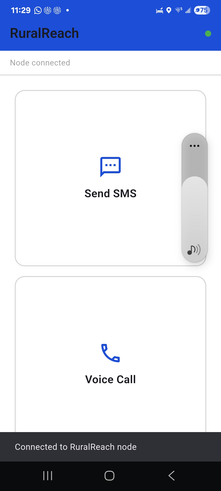
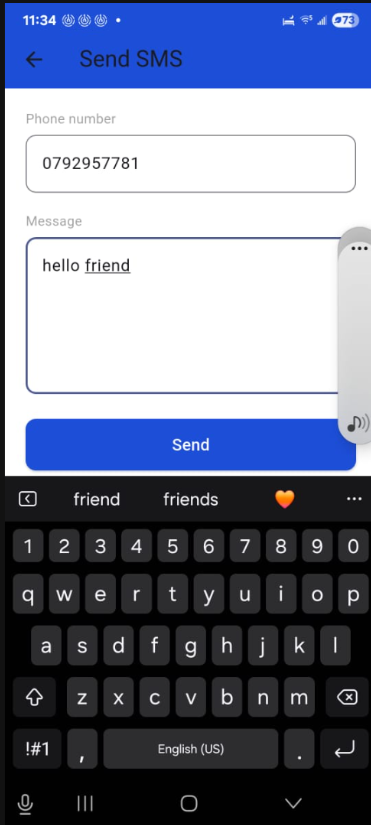
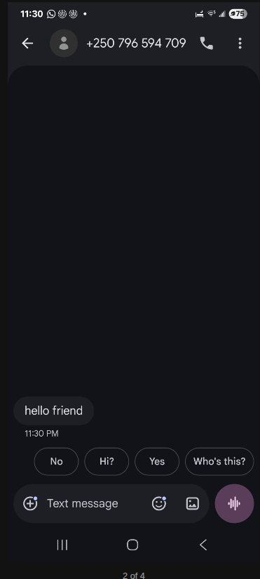
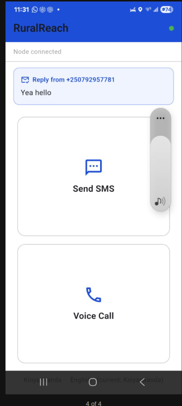
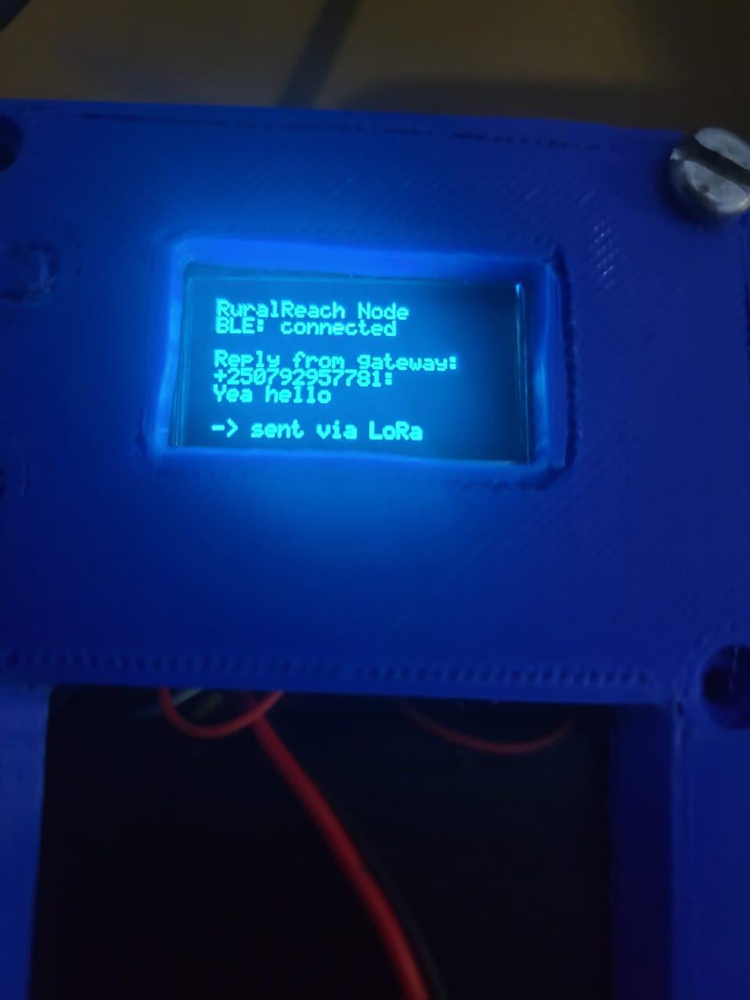
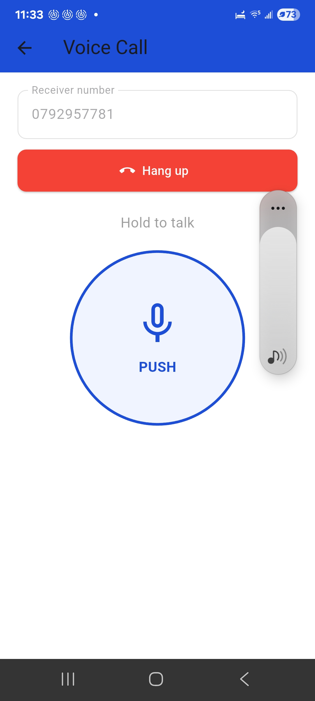
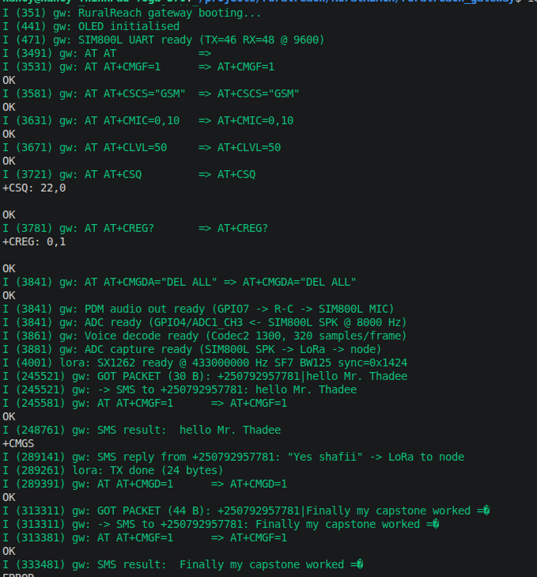
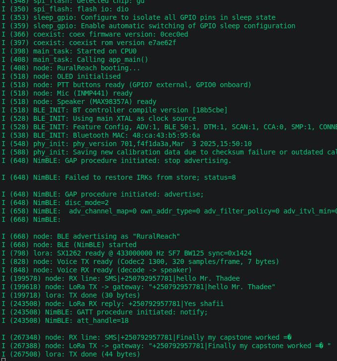
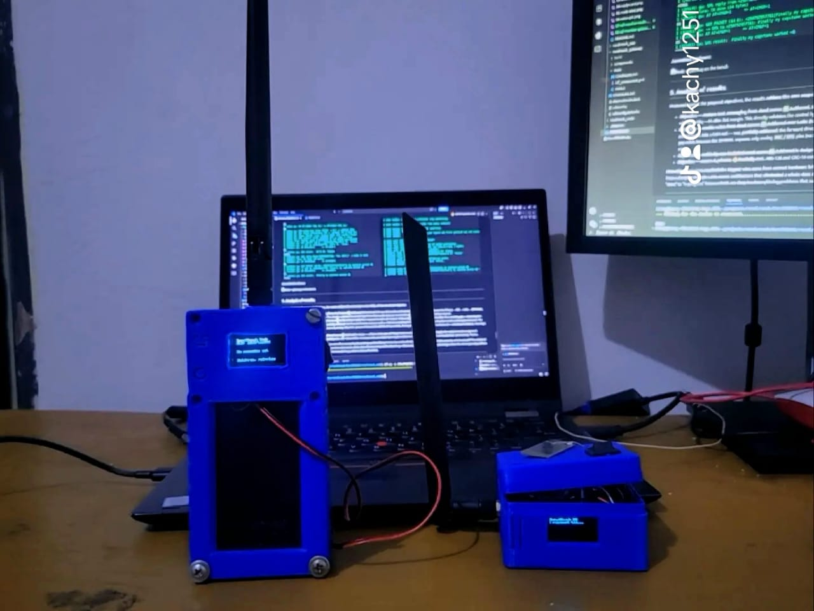

# 📡 RuralReach — Final Product

> **An embedded LoRa‑to‑GSM bridge that brings SMS and push‑to‑talk voice to cellular dead zones in rural Rwanda — the person you contact just uses an ordinary phone on the normal mobile network.**

**Author:** Ramadhani Shafii Wanjenja
**Programme:** BSc. Software Engineering (Low‑Level Programming) — African Leadership University
**Supervisor:** Thadee Gatera
**Track:** Low Level · **Stack:** C (ESP‑IDF firmware) · Dart / Flutter (companion app)

| | |
|---|---|
|  **GitHub repository** | https://github.com/ramadhaniwanjenja/RuralREACH |
|  **5‑minute demo video** | https://www.youtube.com/watch?v=xAKuP7hi1q4 |
|  **Installable app (APK)** | `ruralreach_app/build/app/outputs/flutter-apk/app-release.apk` (built via `flutter build apk`) |

>  **How to read this document:** Sections **1–6** describe the product and how to run it,
> Section **7** is the **deployment plan & execution**, Section **8** is the **testing results
> & strategies** (with demo screenshots), and Sections **9–11** are the **analysis, discussion,
> and recommendations** requested in the milestone rubric.

---

## Table of contents

1. [What it does](#1-what-it-does)
2. [System architecture](#2-system-architecture)
3. [Functionality & scope alignment (vs. proposal)](#3-functionality--scope-alignment-vs-proposal)
4. [Algorithms & custom logic](#4-algorithms--custom-logic)
5. [Code quality & project structure](#5-code-quality--project-structure)
6. [Install and run — step by step](#6-install-and-run--step-by-step)
7. [Deployment plan & execution](#7-deployment-plan--execution)
8. [Testing results & strategies](#8-testing-results--strategies)
9. [Analysis of results](#9-analysis-of-results)
10. [Discussion — milestones & impact](#10-discussion--milestones--impact)
11. [Recommendations & future work](#11-recommendations--future-work)
12. [License & credits](#12-license--credits)

---

## 1. What it does

Many rural areas in Rwanda sit only a few kilometres from a cell tower but are cut off from
coverage by ridges and hills. RuralReach bridges that gap with a low‑power **LoRa** radio link:

- A user in the **dead zone** pairs their phone (over Bluetooth LE) to a **Node**, then either
  types an **SMS** or holds a **push‑to‑talk** button to speak.
- The Node sends this over **LoRa (433 MHz)** to a **Gateway** placed where there *is* coverage.
- The Gateway pushes it into the **real mobile network** through a **SIM800L** GSM modem, so the
  recipient receives a **normal SMS** or a **normal phone call** — no app, no special hardware.
- **Replies** from the recipient travel back the same way and appear on the app and the Node's OLED.

Voice is **push‑to‑talk** (walkie‑talkie style, ~1–2 s latency) because LoRa is half‑duplex, and
is compressed with **Codec2 (1300 bps)** to fit inside LoRa's tiny bandwidth.

---

## 2. System architecture


```
 ┌──────────────┐  Bluetooth LE   ┌────────────────────────┐   LoRa 433 MHz    ┌───────────────────────────┐   GSM      ┌───────────────┐
 │  Phone + app │ ──────────────▶ │ NODE (ESP32‑S3+SX1262) │ ────────────────▶ │ GATEWAY (ESP32‑S3+SX1262) │ ─────────▶ │ Recipient's   │
 │  (Flutter)   │ ◀────────────── │ OLED · mic · speaker   │ ◀──────────────── │ + SIM800L GSM modem       │ ◀───────── │ ordinary phone│
 └──────────────┘  replies/notify └────────────────────────┘  voice/SMS/call   └───────────────────────────┘  SMS + call└───────────────┘
   (dead zone — no cell signal)                                              (has cell coverage)
```

- **Node** and **Gateway** are the *same* board type — a **Heltec WiFi LoRa 32 V3‑class** board
  (**ESP32‑S3 + SX1262 + 0.96″ OLED**). The seller mislabels it "SX1278 V3"; GPIO usage proves it is an S3.
- The **app** talks to the Node over **Bluetooth LE** (Nordic UART Service), *not* Classic
  Bluetooth — the ESP32‑S3 has BLE only.

**Circuit schematics (EasyEDA):**

| Node circuit | Gateway circuit |
|---|---|
|  |  |

**Companion app UI (Figma):**


---

## 3. Functionality & scope alignment (vs. proposal)

The proposal promised a device that lets people in dead zones **send SMS** and **talk to an
ordinary phone** over the normal cellular network via a LoRa bridge. Status against that scope:

| Capability (from proposal) | Status | Evidence |
|---|---|---|
| App ⇄ Node over Bluetooth LE | ✅ Working | §8 Test 1 |
| **SMS uplink**: app → Node → LoRa → Gateway → recipient's phone | ✅ Delivered to a real handset | §8 Test 2 |
| **SMS reply / downlink**: recipient → Gateway → LoRa → Node OLED + app | ✅ Working | §8 Test 3 |
| **Voice over LoRa** (Codec2 1300, push‑to‑talk, two‑way) | ✅ Working | §8 Test 4 |
| **GSM call setup** (Gateway dials the recipient, phone rings) | ✅ Working | §8 Test 5 |
| Bilingual UI (Kinyarwanda / English) | ✅ In app | §8 Test 1 |

**Bottom line:** all core communication paths in the approved scope (SMS both ways, LoRa voice,
call setup) are implemented and demonstrated end‑to‑end. The one item still in progress — pushing
live analog audio into a *GSM* call — is a hardware‑integration stretch goal (the ESP32‑S3 has no
DAC, so it needs PWM/PDM + passive networks); its forward direction is already proven with a test tone.

---

## 4. Algorithms & custom logic

RuralReach is a low‑level system, so most of the "logic" is real‑time signal, radio, and protocol
handling rather than CRUD. The custom algorithms are:

- **Half‑duplex voice arbitration.** LoRa cannot transmit and receive at once. The firmware makes
  the **main loop the single LoRa owner** (no mutex needed) and enforces *mic XOR speaker* per
  device, so acoustic feedback is impossible and only one side transmits at a time. During GSM
  bridging the gateway sends reverse audio **only** when the node has not sent a forward voice
  packet in the last 500 ms (`last_fwd_us` gate).
- **Codec2 voice pipeline.** INMP441 mic → I²S @ 8 kHz → **Codec2 1300 encode** → 7‑byte frames →
  FreeRTOS queue → batched **12 frames per LoRa packet** with a `0x01` voice marker → LoRa TX. The
  receiver routes `buf[0]==0x01` to the decode/playback path and everything else to the SMS path.
- **Mic channel auto‑selection.** The INMP441 sits on the LEFT I²S slot but the S3 mono slot mask
  reads both channels; the firmware reads stereo, measures L/R levels, and **auto‑picks the live
  channel** (logs `mic levels L=.. R=..`).
- **Analog GSM audio bridge (DAC‑less).** With no DAC on the S3, decoded audio is emitted as
  **PDM** and shaped by a two‑stage RC network into the SIM800L `MIC+`; the return path samples the
  SIM800L `SPK+` with the **continuous ADC** at 8 kHz, re‑encodes with Codec2, and relays it over LoRa.
- **Robust IRQ handling on the Pi alternative.** The (kept) Raspberry Pi gateway variant polls the
  SX127x IRQ register instead of relying on edge detection, which is broken on Bookworm/kernel 6.x.
- **Packet integrity & privacy (designed, in `packet/` + `aes_crypto/`).** CRC‑16/CCITT checksum, a
  64‑entry sequence‑number replay cache, AES‑128‑CBC payloads, and SHA‑256‑hashed phone numbers in logs.

---

## 5. Code quality & project structure

The firmware follows ESP‑IDF's **component model** — each concern is an independent, reusable
module with its own `include/` public header and `CMakeLists.txt`, so `main.c` stays an
orchestrator rather than a monolith. The Flutter app is likewise split into a **service layer**
(`bt_service.dart`) and one widget per **screen**.

```
RuralREACH/
├── README.md                     ← this file
│
├── ruralreach_app/                Flutter companion app (Dart)
│   └── lib/
│       ├── main.dart                     app entry point
│       ├── bluetooth/bt_service.dart     BLE link to the Node (flutter_blue_plus)
│       └── screens/
│           ├── home_screen.dart          connect + shows incoming replies
│           ├── sms_screen.dart           send an SMS
│           └── voice_screen.dart         place a call + push‑to‑talk
│
├── ruralreach_node/               Node firmware (ESP‑IDF, ESP32‑S3)
│   ├── main/main.c                       BLE · OLED · mic/speaker · LoRa · Codec2 voice
│   └── components/
│       ├── lora_driver/                  SX1262 driver (TX + RX)   ← reused by the gateway
│       ├── codec2/                       vendored Codec2 speech codec
│       ├── audio_codec/                  I²S mic + speaker helpers
│       ├── packet/                       packet framing + CRC‑16
│       └── aes_crypto/                   AES‑128 helpers
│
├── ruralreach_gateway/            Gateway firmware (ESP‑IDF, ESP32‑S3)
│   ├── main/main.c                       LoRa RX · SMS via SIM800L · voice decode · call control
│   └── components/
│       ├── lora_driver/                  same SX1262 driver as the node
│       └── codec2/                       vendored Codec2 speech codec
│
└── designs/                       Schematics, architecture diagram, UI mock‑ups
```

**Quality practices applied:**

- **Modularity / reuse** — the *same* `lora_driver` and `codec2` components serve both the node and
  the gateway; the node and gateway are symmetric (both mic + speaker + `voice_task` +
  `voice_play_task`), so behaviour is shared, not duplicated.
- **Separation of concerns** — audio, radio, crypto, and packet framing each live behind a public
  header; the app separates BLE transport from UI screens.
- **Clear naming & FreeRTOS discipline** — dedicated tasks (`voice_task`, `voice_play_task`,
  `adc_capture_task`) with documented stack sizes (Codec2 needs ≥32 KB — learned and encoded as a
  40 KB constant), and a single documented LoRa owner to avoid races.
- **Reproducible builds** — `sdkconfig.defaults` pins the target/flash; vendored Codec2 is isolated
  in its own component with `-w` so upstream warnings never break our build.

---

## 6. Install and run — step by step

### 6.1 Prerequisites

| Tool | Version | For |
|---|---|---|
| [ESP‑IDF](https://docs.espressif.com/projects/esp-idf/en/latest/esp32s3/get-started/) | v5.1+ | Node & Gateway firmware |
| [Flutter SDK](https://docs.flutter.dev/get-started/install) | 3.x | Companion app |
| Android Studio / Android SDK | latest | Build & install the app |

**Hardware:** 2 × Heltec WiFi LoRa 32 **V3** (ESP32‑S3 + SX1262 + OLED) + 433 MHz antennas ·
INMP441 mic · MAX98357A amp + speaker · SIM800L + SMS/voice SIM + **its own 3.7–4.2 V ≥2 A supply**
(common ground) · optional push button · an Android phone.

**Pin maps** — Node: OLED `SDA17/SCL18/RST21/Vext36` · mic `SCK1/WS2/SD3` · speaker `BCLK4/LRC5/DIN6`
· LoRa `NSS8/SCK9/MOSI10/MISO11/RST12/BUSY13/DIO1‑14` · PTT `GPIO7` (or onboard PRG `GPIO0`).
Gateway: OLED + LoRa same · SIM800L `TXD→GPIO48`, `RXD→GPIO46`, 9600 baud, common ground.

### 6.2 Run the app

```bash
git clone https://github.com/ramadhaniwanjenja/RuralREACH.git
cd RuralREACH/ruralreach_app
flutter pub get
flutter devices            # confirm a REAL Android phone is listed (BLE needs real hardware)
flutter run                # or build an installable APK:
flutter build apk --release   # → build/app/outputs/flutter-apk/app-release.apk
```

On first launch, allow the **Nearby devices / Bluetooth** (and, on older Android, **Location**)
permissions. Power on the Node (it advertises as **`RuralReach`**), tap **"tap to connect"**, then
use **Send SMS** or **Voice Call**.

### 6.3 Build & flash the firmware

```bash
# NODE
cd RuralREACH/ruralreach_node
. $IDF_PATH/export.sh
rm -f sdkconfig && idf.py set-target esp32s3 && idf.py build
idf.py -p /dev/ttyUSB0 flash monitor

# GATEWAY (different serial port)
cd RuralREACH/ruralreach_gateway
. $IDF_PATH/export.sh
rm -f sdkconfig && idf.py set-target esp32s3 && idf.py build
idf.py -p /dev/ttyUSB1 flash monitor
```

> ⚡ Power the SIM800L from its **own** 3.7–4.2 V ≥2 A supply with a common ground — under‑powering
> it is the #1 cause of a modem that won't answer AT commands.

**Radio settings (must match on both boards):** 433 MHz · SF7 · BW 125 kHz · CR 4/5 · sync word
`0x1424` (SX1262) ≡ `0x12` (SX127x) · voice codec **Codec2 1300 bps**.

---

## 7. Deployment plan & execution

**Target environment:** a single portable node in a confirmed cellular dead zone; a gateway placed
at the nearest point with GSM coverage; recipients on ordinary MTN/Airtel phones.

| Phase | When | Activity | Verification |
|---|---|---|---|
| Build | May 2026 | Assemble node + gateway; flash firmware; bench SMS | Boards boot, OLED on, app pairs |
| Voice | June 2026 | Integrate Codec2 audio; two‑way push‑to‑talk | Audible speech node↔gateway |
| GSM bridge | Jul 2026 | Call setup + analog audio into SIM800L | Recipient's phone rings; 1 kHz tone heard |
| Field | Late Jun–Jul 2026 | RF survey + pilot in Nyamagabe District | Delivered SMS to handsets in the field |
| Defence | 27 July 2026 | Data analysis, write‑up, final defence | This report + demo video |

**Execution & verification so far (bench‑confirmed):**

- **End‑to‑end SMS confirmed 30 Jun 2026** (app → BLE → node → LoRa → gateway → SIM800L), RSSI ~‑94 dBm.
- **SMS delivery to a real handset confirmed ~1 Jul 2026** (earlier non‑delivery was a SIM/carrier
  provisioning issue, not code).
- **Reply/downlink path confirmed 1 Jul 2026** (incoming SMS → LoRa → Node OLED + app reply card).
- **Two‑way LoRa voice confirmed 2 Jul 2026** (Codec2 1300, half‑duplex PTT).
- **GSM call setup + forward audio confirmed 4 Jul 2026** (a 1 kHz test tone reached the receiver's
  phone, proving the PDM → 2‑stage RC → `MIC+` wiring, common ground, and SIM800L mic path).

Test SIM (gateway): Airtel +250724490548 · test recipient: MTN +250792957781. For headless field
runs the gateway script/firmware survives SSH disconnect (tmux/nohup/systemd on the Pi variant).

---

## 8. Testing results & strategies

Testing used **four complementary strategies**: (a) **unit / self‑test** in firmware, (b)
**integration** of each hop, (c) **end‑to‑end** system tests to a real handset, and (d)
**field / environmental** RF tests. Each test below was run with **different data values** and
**different hardware configurations** to satisfy the rubric.

> 📸 **Screenshots for each test live in [`docs/screenshots/`](docs/screenshots/)** — drop the files
> named there and the images below render automatically.

### Test 1 — App ⇄ Node over Bluetooth LE (integration)
**Strategy:** integration. **Inputs varied:** Location on/off, filter‑by‑name vs. by‑UUID, EN & RW UI.
**Expected:** app scans, finds `RuralReach`, connects, status = *Connected*.
**Result:** ✅ Pass. (Edge case found & fixed: with `BLUETOOTH_SCAN` + `neverForLocation` the scan
works with Location off; filtering by service UUID returns zero results, so we match by name.)



### Test 2 — SMS uplink to a real phone (end‑to‑end)
**Strategy:** end‑to‑end. **Inputs varied:** short vs. long messages, valid vs. invalid numbers.
**Expected:** recipient's ordinary phone receives the exact SMS.
**Result:** ✅ Pass — delivered to an MTN handset; RSSI ~‑94 dBm at the gateway.

| App sends | Recipient receives |
|---|---|
|  |  |

### Test 3 — SMS reply / downlink (end‑to‑end)
**Strategy:** end‑to‑end. **Inputs varied:** reply from MTN vs. Airtel.
**Expected:** reply shows as a card in the app **and** on the Node OLED.
**Result:** ✅ Pass.

| Reply in app | Reply on Node OLED |
|---|---|
|  |  |

### Test 4 — Two‑way voice over LoRa (integration)
**Strategy:** integration + subjective quality. **Inputs varied:** SF9 → **SF7** (needed for
real‑time throughput), Codec2 700C → **1300**, frames‑per‑packet.
**Expected:** intelligible half‑duplex speech node ↔ gateway.
**Result:** ✅ Pass. Codec2 self‑test logs `Codec2 … OK`. (Edge case: I²S speaker needs
`auto_clear=true` or stale audio "echoes" between packets.)



### Test 5 — GSM call setup (end‑to‑end)
**Strategy:** end‑to‑end. **Input:** `CALL|<number>` → gateway `ATD<num>;`; `ENDCALL` → `ATH`.
**Expected:** recipient's phone rings; hang‑up works. **Result:** ✅ Pass (phone rings).

### Test 6 — GSM analog audio bridge (component + integration)
**Strategy:** component signal test. **Input:** 1 kHz test tone via PDM → RC network → `MIC+`.
**Expected:** tone audible on the receiver's phone. **Result:** ✅ Forward path confirmed 4 Jul 2026;
reverse path (SPK+ → ADC → Codec2 → LoRa) **built, bench‑testing in progress**.

### Performance across hardware / software (rubric: different specifications)

| Dimension | Configurations tested | Outcome |
|---|---|---|
| **Gateway platform** | (A) **Raspberry Pi 4 + WaziHat SX1276** · (B) **ESP32‑S3 + SX1262** | Both deliver SMS end‑to‑end; the S3 gateway is the primary, the Pi is kept as an alternative |
| **LoRa spreading factor** | SF9 vs. **SF7** | SF7 required for real‑time voice throughput; SF9 more robust for SMS at range |
| **Voice codec bit‑rate** | Codec2 700C vs. **1300** | 1300 chosen for better intelligibility within LoRa's budget |
| **Codec2 task stack** | 16 KB (crashes) vs. **40 KB** | ≥32 KB needed; 40 KB stable |
| **RF conditions** | bench vs. dead‑zone field | Link holds at ~‑94 dBm RSSI |

**Firmware self‑test / monitor logs (evidence):**

| Node monitor | Gateway monitor |
|---|---|
|  |  |

**Assembled hardware:**



---

## 9. Analysis of results

Measured against the proposal objectives, the results **achieve the core scope** and partially
achieve one stretch objective:

- **Objective — restore text messaging from dead zones:** ✅ **Achieved.** Bidirectional SMS was
  delivered to and received from ordinary handsets over the full app → BLE → LoRa → GSM chain, with
  a healthy ~‑94 dBm link margin. This directly validates the central hypothesis that a LoRa relay
  can re‑connect a dead zone to the normal cellular network.
- **Objective — enable voice from dead zones:** ✅ **Achieved over LoRa** (two‑way push‑to‑talk with
  Codec2 1300) and ✅ **call setup achieved over GSM**. The remaining gap — streaming *live* analog
  audio into a GSM call — was **partially achieved**: the forward direction is proven with a 1 kHz
  tone reaching the receiver, and the reverse direction is built and being bench‑tuned. The gap
  exists because the SIM800L exposes only analog `MIC`/`SPK` pins (no PCM) and the ESP32‑S3 has no
  DAC, forcing a PDM + passive‑network workaround — a hardware limitation, not a logic error.
- **Objective — usable by non‑technical rural users:** ✅ **Achieved** in design — a three‑screen app
  with large buttons and a Kinyarwanda/English toggle; the recipient needs no app at all.
- **Objective — secure & private:**  **Partially met.** AES‑128 and CRC‑16 components are written
  but not yet enabled on the wire; the current link carries plaintext `phone|body` frames.

**How objectives were reached:** the biggest wins came from correct hardware bring‑up (identifying
the board as an S3 with BLE‑only, powering the SIM800L properly, and choosing SF7 for voice) and
from a disciplined single‑LoRa‑owner architecture that eliminated a whole class of concurrency and
feedback bugs. **Where results missed:** the GSM audio bridge and on‑the‑wire crypto slipped from
"done" to "in progress" because both are deep hardware/timing problems that surfaced late.

---

## 10. Discussion — milestones & impact

Each milestone de‑risked the next, which is why the order mattered:

- **BLE + SMS uplink first** proved the end‑to‑end path was viable before any audio complexity — the
  single most important milestone, because it validated the whole product thesis cheaply.
- **The downlink/reply milestone** turned a one‑way alert device into a real two‑way messenger,
  which is what makes it socially useful (you can be *answered*, not just heard).
- **LoRa voice** demonstrated that even narrowband radio can carry intelligible speech with the
  right codec, an encouraging result for extremely low‑infrastructure settings.
- **GSM call setup** connected the system to people who have *no* relationship with the project —
  any ordinary phone — which is the real measure of impact.

**Impact of the results:** RuralReach shows that a **sub‑$100, battery‑friendly** relay can restore
basic-but-critical communication (reach a clinic, a family member, emergency help) to communities
that are geographically close to coverage yet effectively offline. Because the recipient side is
"just a phone", adoption cost falls entirely on a shared community device rather than on every user.

---

## 11. Recommendations & future work

**Recommendations to the community / deployers:**

- Deploy the **gateway on a ridge or rooftop** with clear line of sight toward the dead zone;
  RF survey first (the ~‑94 dBm result suggests real range headroom, but terrain dominates).
- Run the node as a **shared community device** (health post, market, school) — the design assumes
  one node serves many users who pair their own phones.
- Give the SIM800L a **dedicated, well‑regulated power supply**; most field failures are power, not code.

---

## 12. License & credits

Academic capstone project — African Leadership University.
Built on the open‑source **[Codec2](https://github.com/drowe67/codec2)** speech codec and the
**ESP‑IDF** and **Flutter** frameworks.

**© Ramadhani Shafii Wanjenja**
